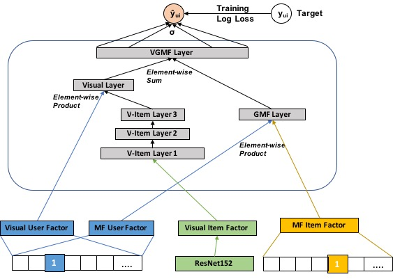

# Seeing is Believing: A Movie Recommender System with PosterAugmentation
Movie posters signal the style and content of the films. By including the visual information, the movie recommend system can better filter preferences according to user's choices. A deep learning recommend system, Neural Collaborative Filtering, obtain a great performance by using neural networks to learn user-item embedding features. The authors propose three networks, which are Generalized Matrix Factorization (GMF), Multi-Layer Perceptron (MLP), and Neural Matrix Factorization (NeuMF). This repo include visual information into the models and propose VGMF and VNeuMF. The image below is the model architechture of VNeuMF.

<!--  -->
<p align="center"> 
    
</p>

The authors of NCF published [a nice implementation](https://github.com/hexiangnan/neural_collaborative_filtering) written in **tensorflow(keras)**, and [LaceyChen17](https://github.com/LaceyChen17/neural-collaborative-filtering) provides the implementation written in **pytorch**. This repo implement VGMF and VNeuMF model based on [LaceyChen17's code](https://github.com/LaceyChen17/neural-collaborative-filtering). Note that this is the course project of CSCE 670 Information Storage and Retrieval in Texas A&M University.

## Dataset
[The Movielens 1M Datasets](https://grouplens.org/datasets/movielens/1m/) is used to test the repo.

## Movie Poster Embeddings
We scrape the movie poster images from IMDB website and use Resnet152 (pretrained on ImageNet) to obtain our movie poster embedding features. The correspondence movieId to imdbId is in the file links.csv. (or you can just download the embeddings with  `download.py`)

## How to run
- Clone this repository:
```bash
$ git clone --recursive https://github.com/yyyjoe/neural-collaborative-filtering.git
```

- Go to src directory.

- Download movie poster embedding features:
```bash
$ python download.py
```

- Train the model (checkpoints saved in `./checkpoints/MODEL_NAME/`)
```bash
# python train.py --model MODEL_NAME(gmf, vgmf, neumf, vneumf)
$ python train.py --model gmf
```

- You can modify the training setting in `config_factory.py`

## Performance
All models are trained from scratch with constant learning rate. Better performance can be achieved with careful tuning hyper params.


Experiments' results with `num_negative_samples = 4` and `dim_latent_factor=4`  are shown as follows

### GMF v.s. VGMF
<p align="center"> 
    
</p>

### NeuMF v.s. VNeuMF
<p align="center"> 
    
</p>

