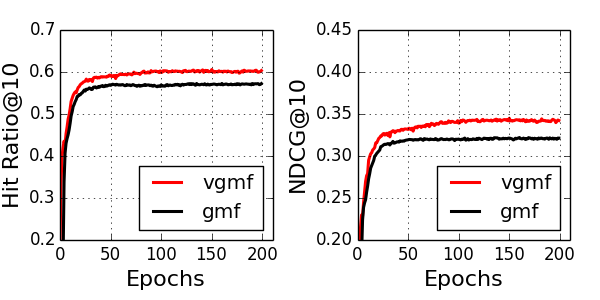
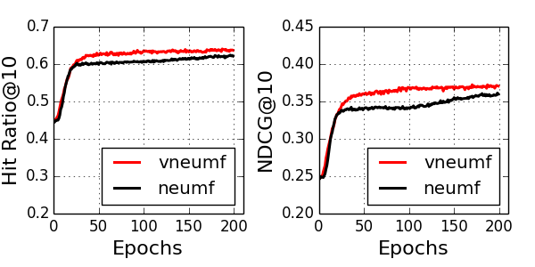

# Using Movie Posters in Movie Recommender System
Movie posters signal the style and content of the films. By including the visual information, the movie recommend system can better filter preferences according to user's choices. A deep learning recommend system, Neural collaborative filtering(NCF), obtain a great performance by using neural networks to learn user-item embedding features. This repo extend NCF model as visual NCF by learning the user-poster embedding features.

The authors of NCF published [a nice implementation](https://github.com/hexiangnan/neural_collaborative_filtering) written in tensorflow(keras), and [LaceyChen17](https://github.com/LaceyChen17/neural-collaborative-filtering) provides the implementation written in **pytorch**. This repo implement visual NCF model based on [LaceyChen17's code](https://github.com/LaceyChen17/neural-collaborative-filtering).


## Dataset
[The Movielens 1M Datasets](https://grouplens.org/datasets/movielens/1m/) is used to test the repo.

## Movie Poster Embeddings
We scrape the movie poster images from IMDB website and use Resnet152 (pretrained on ImageNet) to obtain our movie poster embedding features. The correspondence movieId to imdbId is in the file links.csv. (or you can just download the embeddings with  `download.py`)

## How to run
- Clone this repository:
```bash
$ git clone --recursive https://github.com/yyyjoe/neural-collaborative-filtering.git
```

- Go to src directory.

- Download movie poster embedding features:
```bash
$ python download.py
```

- Train the model (checkpoints saved in `./checkpoints/MODEL_NAME/`)
```bash
# python train.py --model MODEL_NAME(gmf, vgmf, mlp, neumf, vneumf)
$ python train.py --model gmf
```

- You can modify the training setting in `config_factory.py`

## Performance
All models are trained from scratch with constant learning rate. Better performance can be achieved with careful tuning hyper params.


Experiments' results with `num_negative_samples = 4` and `dim_latent_factor=4`  are shown as follows

### GMF v.s. VGMF

### NeuMF v.s. VNeuMF



